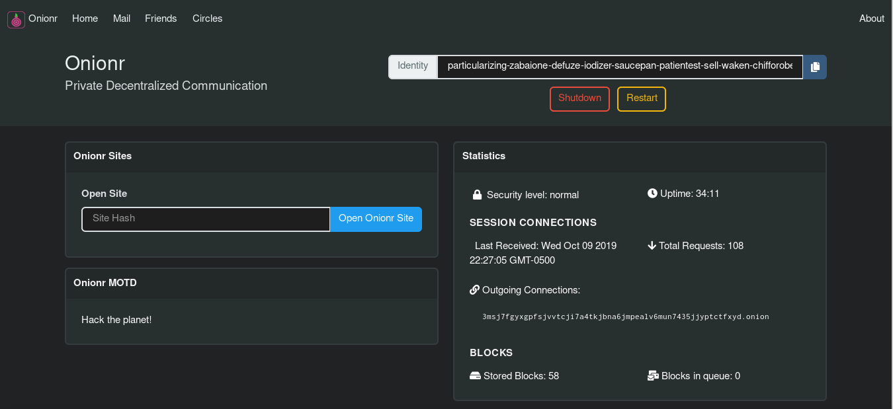

    Privacy Respecting Communication Network 📡

    Anonymous social platform, mail, file sharing.

   

  - [Discord](https://discord.gg/DVF2bEAzrt) - Matrix: #onionr:amorgan.xyz

|                                      |                            |                            |
| -----------                          | -----------                | -----------                |
| [Install](#install-and-run-on-linux) | [Features](#main-features) | [Screenshots](#screenshots)|
| [Docs](#documentation)/[web copy](https://beardog108.github.io/onionr/)               | [Get involved](#help-out)  | [Onionr.net](https://onionr.net/)/[.onion](http://onionrbak72t5zhbzuey2fdkpczlvhowgcpqc6uoyrd3uxztzxwz5cyd.onion/)                  |

---

**The main repository for this software is at https://git.VoidNet.tech/kev/onionr/**

Mirrors: [Github](https://github.com/beardog108/onionr), [Gitlab](https://gitlab.com/beardog/onionr)

Onionr ("Onion Relay") is a decentralized/distributed peer-to-peer communication network, designed to be anonymous and resistant to (meta)data analysis, spam, and corruption.

Onionr gives the individual the ability to speak freely, without fear of surveillance and censorship.

---

Onionr stores data in independent packages referred to as 'blocks'. The blocks are distributed to all nodes interested in their data type. Blocks and user IDs cannot be easily proven to have been created by a particular user. Even if there is enough evidence to believe that a specific user created a block, nodes still operate behind Tor and as such cannot be trivially unmasked. Anonymity is achieved by a stateless network, with no given indication of what node a block originates from. In fact, since one is not required to participate in routing or storage to insert a message, blocks often do not originate from any identifiable node.

Onionr works primarily via epidemic/gossip style routing, with message delivery taking roughly logF(N) cycles where F is the number of nodes to send a message to each cycle and N is the number of connected nodes. So a network of 100 million nodes can deliver messages in a few minutes even with high packet loss and malfunctioning nodes.

Through message mixing and key privacy, it is intended to be nigh impossible to discover the identity of a message creator or recipient. Via long-term traffic analysis, a well funded adversary may discover the most probable node(s) to be creating a set of related blocks, however doing so would only lead them to a node behind Tor. As the first node that a block appears on is almost always not the creator of the block, there is plausible deniability regarding the true creator of the block.

Users are identified by ed25519/curve25519 public keys, which can be used to sign blocks or send encrypted data.

Onionr can be used for mail, as a social network, instant messenger, file sharing software, or for encrypted group discussion.

Due to the nature of anonymity, the graph as implemented in this reference network is dense, undirected, cyclic and can be disconnected. Since Onionr is technically just a data format, any routing scheme can be used to pass messages.

The whitepaper is available [here](docs/whitepaper.md).

---

## Main Features

* [X] 🌐 Fully p2p/decentralized, no trackers or other single points of failure
* [X] 🔒 End to end encryption of user data
* [X] 📢 Optional non-encrypted blocks, useful for blog posts or public file sharing
* [X] 💻 Easy HTTP API for integration to websites
* [X] 🕵️ Metadata analysis resistance and anonymity
* [X] 📡 Transport agnosticism (no internet required)

Onionr ships with various application plugins ready for use out of the box:

Currently usable:

* 📨 Mail
* 💬 Public anonymous chat/message board
* 📃 Simple webpage hosting - Will be greatly extended
* File sharing (Work in progress)

Not yet usable:

* Instant messaging

# Screenshots

Home screen

Friend/contact manager

Encrypted, metadata-masking mail application. One of the first distributed mail systems to have basic forward secrecy.

# Documentation

More docs coming soon.

* [Block specification](docs/dev/specs/block-spec.md)
* [HTTP API](docs/dev/http-api.md)

# Install and Run on Linux

The following applies to Ubuntu Bionic. Other distributions may have different package or command names.

Master may be unstable, you should use the latest release tag. (checkout via git: `$ git checkout release-latest`)

`$ sudo apt install python3-pip python3-dev tor`

* Have python3.7+, python3-pip, Tor (daemon, not browser) installed. python3-dev is recommended.
* You may need build-essentials or the equivalent of your platform
* Clone the git repo: `$ git clone https://gitlab.com/beardog/onionr --tags`
* cd into install direction: `$ cd onionr/`
* Install the Python dependencies ([virtualenv strongly recommended](https://virtualenv.pypa.io/en/stable/userguide/)): `$ pip3 install --require-hashes -r requirements.txt` (on ARM64 devices like Raspberry Pi 4's use requirements-ARM.txt instead.)
* (Optional): Install desktop notification dependencies: `$ pip3 install --require-hashes -r requirements-notifications.txt`

(--require-hashes is intended to prevent exploitation via compromise of PyPi/CA certificates)

## Run Onionr

* Run Onionr normally:  `$ ./onionr.sh start`
* Run Onionr in background as daemon: `$ ./start-daemon.sh`
* Open Onionr web interface  `$ ./onionr.sh openhome`
* Gracefully stop Onionr from CLI `$ ./onionr.sh stop`

# Contact/Community

* Email: beardog [ at ] mailbox.org
* Twitter: [@onionrnet](https://twitter.com/onionrnet)
* Onionr Mail: decentralized-fiery-freehearted-skimmer-yodling-topstitch-divorceable-ojibwa-resettlement-infracted-lessor-noninstinctual-leaseholder-counterpoised-couture-skinful
* Matrix: #onionr:amorgan.xyz
* Discord: https://discord.gg/DVF2bEAzrt (Discord is bad for freedom and privacy, this is only provided for convienience)

# Help out

Everyone is welcome to contribute. Help is wanted for the following:

* Development (Get in touch first)
    * Creation of a shared lib for use from other languages and faster proof-of-work
    * Android and IOS development
    * Mac support (already partially supported, testers needed)
    * Bug fixes and development of new features
* Testing
* Translations/localizations
* UI/UX design
* Running stable nodes
* Security review/audit
* I2P support

## Watch the talk from BSidesPDX 2019

## Contribute money:

Donating at least $3 gets you cool Onionr stickers. Get in touch if you want them.

* Bitcoin: [1onion55FXzm6h8KQw3zFw2igpHcV7LPq](bitcoin:1onion55FXzm6h8KQw3zFw2igpHcV7LPq) (Contact us for a unique address or for other coins)

* Monero: 4B5BA24d1P3R5aWEpkGY5TP7buJJcn2aSGBVRQCHhpiahxeB4aWsu15XwmuTjC6VF62NApZeJGTS248RMVECP8aW73Uj2ax

* USD (Card/Paypal (no account required)): [Ko-Fi](https://www.ko-fi.com/beardogkf)

* Sign up for [privacy.com (refferal link)](https://privacy.com/join/FNNDF) to protect your personal information when contributing or shopping elsewhere, we both get $5 USD.

Note: probably not tax deductible

# Security

Onionr is alpha software. This means it is unstable, probably insecure, and experimental.

No matter how good Onionr and other software gets, there will always be ways for clever or well-funded adversaries to break your security.

Onionr does not protect your identity if you associate your user ID with your name either on Onionr or elsewhere.

*Do not rely on Onionr or any other software to hold up if your life or liberty are at stake.*

### Licenses and Branding

Onionr is published under the GNU GPL v3 license, except for the logo.

The Tor Project and I2P developers do not own, create, or endorse this project, and are not otherwise involved.

Tor is a trademark for the Tor Project. We do not own it.

## Onionr Logo

The Onionr logo was created by [Anhar Ismail](https://github.com/anharismail) under the [Creative Commons Attribution 4.0 International License](https://creativecommons.org/licenses/by/4.0/).

If you modify and redistribute our code ("forking"), please use a different logo and project name to avoid confusion. Please do not use the project name or logo in a way that makes it seem like we endorse you without our permission.
