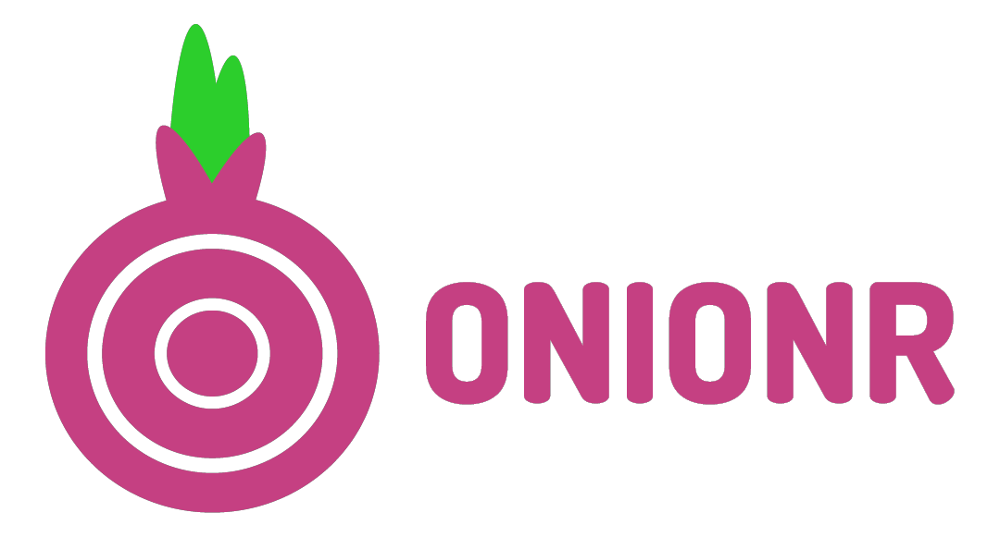
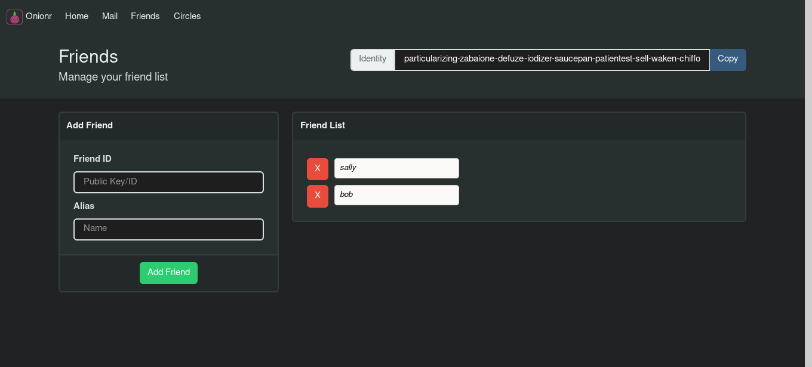

    Private P2P Communication network 🕵️

(***pre-alpha & experimental, not well tested or easy to use yet***)

**The main repository for this software is at https://gitlab.com/beardog/Onionr/**

# About

Onionr is a decentralized, peer-to-peer communication and storage network, designed to be anonymous and resistant to (meta)data analysis, spam, and corruption.

Onionr stores data in independent packages referred to as 'blocks'. The blocks are synced to all other nodes in the network. Blocks and user IDs cannot be easily proven to have been created by a particular user. Even if there is enough evidence to believe that a specific user created a block, nodes still operate behind Tor or I2P and as such cannot be trivially unmasked.

Users are identified by ed25519/curve25519 public keys, which can be used to sign blocks or send encrypted data.

Onionr can be used for mail, as a social network, instant messenger, file sharing software, or for encrypted group discussion.

The whitepaper (subject to change prior to alpha release) is available [here](docs/whitepaper.md).

## Main Features

* [X] 🌐 Fully p2p/decentralized, no trackers or other single points of failure
* [X] 🔒 End to end encryption of user data
* [X] 📢 Optional non-encrypted blocks, useful for blog posts or public file sharing
* [X] 💻 Easy API for integration to websites
* [X] 🕵️ Metadata analysis resistance and anonymity
* [X] 📡 Transport agnosticism (no internet required)

**Onionr API and functionality is subject to non-backwards compatible change during pre-alpha development**

# Screenshots

Node statistics

Friend/contact manager

Encrypted, metadata-masking mail application. One of the first distributed mail systems to have basic forward secrecy.

# Documentation

More docs coming soon.

* [Block specification](docs/specs/block-spec.md)
* [HTTP API](docs/http-api.md)

# Install and Run on Linux

The following applies to Ubuntu Bionic. Other distros may have different package or command names.

`$ sudo apt install python3-pip python3-dev tor`

* Have python3.6+, python3-pip, Tor (daemon, not browser) installed (python3-dev recommended)
* Clone the git repo: `$ git clone https://gitlab.com/beardog/onionr`
* cd into install direction: `$ cd onionr/`
* Install the Python dependencies ([virtualenv strongly recommended](https://virtualenv.pypa.io/en/stable/userguide/)): `$ pip3 install --require-hashes -r requirements.txt`

(--require-hashes is intended to prevent exploitation via compromise of PyPi/CA certificates)

# Help out

Everyone is welcome to contribute. Help is wanted for the following:

* Development (Get in touch first)
    * Creation of a shared lib for use from other languages and faster proof-of-work
    * Android and IOS development
    * Windows and Mac support (already partially supported, testers needed)
    * General bug fixes and development of new features
* Testing
* UI/UX design
* Running stable nodes
* Security review/audit
* Automatic I2P setup

Contribute money:

Donating at least $5 gets you cool Onionr stickers. Get in touch if you want them.

Bitcoin: [1onion55FXzm6h8KQw3zFw2igpHcV7LPq](bitcoin:1onion55FXzm6h8KQw3zFw2igpHcV7LPq) (Contact us for a unique address or for other coins)

Monero: 4B5BA24d1P3R5aWEpkGY5TP7buJJcn2aSGBVRQCHhpiahxeB4aWsu15XwmuTjC6VF62NApZeJGTS248RMVECP8aW73Uj2ax

USD (Card/Paypal): [Ko-Fi](https://www.ko-fi.com/beardogkf)

Note: probably not tax deductible

## Contact

Email: beardog [ at ] mailbox.org

## Disclaimers and legal

Onionr is published under the GNU GPL v3 license.

The Tor Project and I2P developers do not own, create, or endorse this project, and are not otherwise involved.

Tor is a trademark for the Tor Project. We do not own it.

The 'open source badge' is by Maik Ellerbrock and is licensed under a Creative Commons Attribution 4.0 International License.

## Logo

The Onionr logo was created by [Anhar Ismail](https://github.com/anharismail) under the [Creative Commons Attribution 4.0 International License](https://creativecommons.org/licenses/by/4.0/). 

If you modify and redistribute our code ("forking"), please use a different logo and project name to avoid confusion. Please do not use the project name or logo in a way that makes it seem like we endorse you without our permission.

