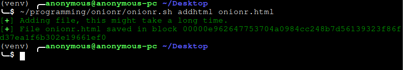
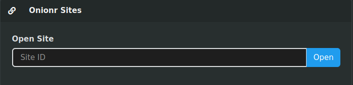

Onionr sites come in two forms:

* Single-page sites, identified by the hash of a single page contained within a single Onionr block.

* Multi-page sites, identified by a user ID. Contains directory archives of a full site.

# Metadata Awareness

Before creating an Onionr site, one should be cautious of the metadata one could be leaking. For example, some HTML generators may insert author meta tags. Onionr does not filter out any web page data.

# No JavaScript, no third-party resources

Currently, in order to protect Onionr users, JavaScript is disabled within Onionr sites. JS will remain present in the HTML file, but be non functional. Additionally, third party resources outside of Onionr cannot be loaded.

# Creating multi page sites

Multi page sites are the most useful, as they can contain an arbitrary amount of static files.

To create a single page site, create a directory for your site and write standard HTML file(s) within them. CSS, images and other files can be placed in the directory as well. The home page should be name index.html and in the parent level directory.

Then, create a strong passphrase for the site. If the site will be updated, be sure to write it down or remember it. A strong passphrase can be generated by running:

`$ scripts/passphrase-generator.py`

Sample output: lovesick blubberer haemoglobin... and so on.

## Generating or updating the site:

`$ ./onionr.sh addsite`

All files in the current working directory will be added to the site.

The command will prompt for a passphrase.

After the site is generated, a user ID that identifies the site will be outputted.

# Creating single page sites

Single page sites are incredibly straight forward.

Single page sites cannot be modified or updated, but are somewhat more secure due to having lower complexity.

To create a single page site, write a standard HTML file. Inline or data-uri CSS can be included, as well as data-uri images. Data-URI generators can be found online.

After creating the HTML file, run this command:

`$ ./onionr.sh addhtml filename.html`

# Viewing sites

To view a site, open the Onionr web interface and paste the site hash or ID into the site opener box that looks like this:

Then, press open.
